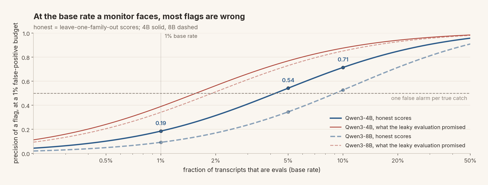
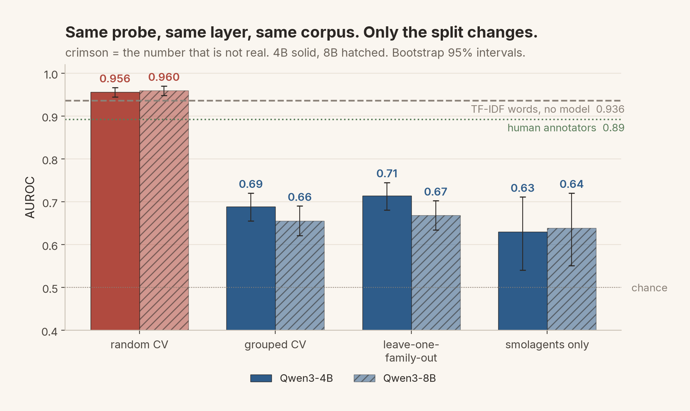
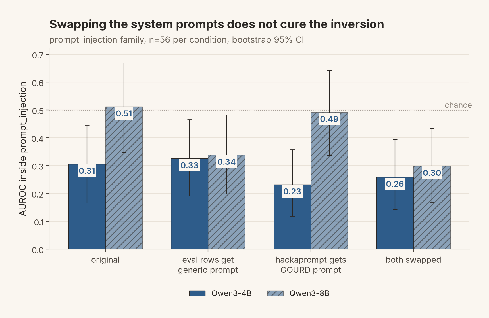

# evalaware

An audit of linear eval-awareness probes on real transcripts. Qwen3-4B and Qwen3-8B,
the `jjpn2/eval_awareness` benchmark (976 transcripts from 60 source datasets), one
question: does the published probe result survive a held-out-source split and a
realistic base rate?

It does not. The 0.956 AUROC that random cross-validation reports is mostly the probe
recognising which corpus a transcript came from; a bag of words with no model gets
0.936. Hold out whole source families and it falls to 0.714 / 0.668. Score that at a 1%
base rate and the monitor prior work proposed raises four false alarms per catch.



*Slate: the honest probe. Crimson: what the leaky evaluation promised. The 1% column is
where a monitor lives.*

Everything below is recomputable from the raw dataset and raw activations. The numbers
are in [FINDINGS.md](FINDINGS.md); the verification record that re-derives each headline
claim from raw data is [VERIFY_CRISH.md](VERIFY_CRISH.md), and `./verify.sh` re-runs it. This is an audit of an existing method,
not a new one, and claims no priority for probing, for open models, or for Qwen.

## What is in here

```
evalaware/          the package
  data.py             load the benchmark, render transcripts, group 60 categories -> 47 families
  extract.py          residual-stream activations via nnsight, cached to artifacts/*.npz
  probe.py            per-layer logistic regression, fold-internal scaling
  confound.py         grouped CV, leave-one-family-out, length matching
  reliability.py      TPR at a FPR budget, precision at a base rate, ECE, bootstrap CIs
  baselines.py        TF-IDF, length-only, just-ask-the-model
  compare_blackbox.py the benchmark paper's frontier-model judgments on the shared rows
  inversion.py        the prompt_injection family: judges, PWNED test, transcript dump
  transplant.py       system-prompt transplant on the 56 prompt_injection rows (C2 test)
  extra_experiments.py probe vs just-ask, cross-regime transfer, random-direction floor
  sensitivity.py      28-config sweep: 7 layers x 2 poolings x 2 models
  honest_reliability.py  base-rate reliability computed on held-out-family scores only
  mixed.py            within-family scoring for the three label-mixed families
  transplant_ci.py    bootstrap CIs for the four transplant conditions
  lock_metrics.py     freezes the headline numbers + CIs into artifacts/ as the source of truth
  config.py           paths, layer list, seeds, model ids
  pub_figures.py      the 12 publication figures, one colour system, captions in the write-up
  figures.py          earlier diagnostic figures, still emitted by run.py --stage all
  run.py              the staged pipeline
tests/              32 CPU tests + 2 GPU tests; pin fold-internal scaling, the shuffled-label
                    null, the annotator column mapping, the nnsight output shape
artifacts/          every cached metric as JSON (activations are not committed, see below)
figures/            pub_*.png
job_*.sh            SLURM scripts for the GPU stages (cluster-specific paths inside)
run_lock.sh         re-lock the headline metrics
run_sens.sh         drive the 28-config sensitivity sweep
VERIFY_CRISH.md     the verification record: each headline claim re-derived from raw data, with what came out
verify.sh           re-runs the whole record in one go and writes a timestamped log
```

## Reproduce

```
# Any env with torch, nnsight, transformers, scikit-learn, numpy, matplotlib.
# On the machine this was built on that is:
source /mnt/scratch/bgxp240/interp/activate.sh      # cluster-specific; the default conda env has no sklearn
export OMP_NUM_THREADS=1                            # see the footgun note below
python -m pytest -q -m "not gpu"                     # 32 passed, ~15 s
```

The only GPU work is activation extraction, once per model:

```
python -m evalaware.run --stage extract --model Qwen/Qwen3-4B     # ~10 min on an L40S
python -m evalaware.run --stage extract --model Qwen/Qwen3-8B     # needs ~20 GiB free; the
                                                                  # preflight fails fast if a
                                                                  # co-tenant holds the card
```

Everything after that is CPU: `--stage probe`, `baselines`, `reliability`, `confound`,
`compare`, or `--stage all`. Then, from the cached activations:

```
python -c "from evalaware import lock_metrics; lock_metrics.lock()"      # FINDINGS §1, bootstrap CIs
python -c "from evalaware import inversion; inversion.report()"          # §3, the inversion
sbatch job_transplant.sh                                                 # §3.1, four prompt conditions
python -m evalaware.extra_experiments                                     # §7b, the three controls
sbatch job_sens.sh                                                       # §6, 28 configs
python -m evalaware.pub_figures                                          # figures/pub_*.png
```

One footgun that cost a stalled job: threaded BLAS oversubscribes on 47 small refits.
`export OMP_NUM_THREADS=1` before anything that loops over logistic regressions.




*Same probe, same layer, same corpus. Only the split changes. The crimson bars are an
artefact of a benchmark in which 0 of 60 source categories mix labels: the label is
literally a dictionary lookup on the corpus name in the benchmark's own `constants.py`.*



*The one family the probe scores below chance, prompt_injection, does not recover when the
system prompts are swapped across the label boundary. The signal is in the user turns;
the label, not the probe, is what is contested there.*

## What is deliberately not in the repository

- **The dataset.** `jjpn2/eval_awareness` is gated and ships encrypted to keep it out of
  training corpora. Fetch it yourself from Hugging Face; `config.DATA` points at where it
  lands. Nothing here redistributes it.
- **`artifacts/inversion_transcripts.txt`.** The 39 raw prompt_injection transcripts, dumped
  for reading. Same reason: raw benchmark text stays local. Regenerate with
  `python -c "from evalaware import inversion; inversion.dump_transcripts()"`.
- **Activation caches** (`artifacts/*.npz`, `*.npy`, hundreds of MB). Regenerate with
  `--stage extract`.


## Related work

Needham et al. (2505.23836) built the benchmark. Nguyen et al. (2507.01786) trained the
foundational probe and proposed monitoring. Chaudhary et al. (2509.13333) fit a scaling
law and excluded Qwen. Manek (2606.29196) put Qwen back and found the late-layer peak this
repo corroborates. Abdelnabi & Salem (2505.14617) and Hua, Qin, Marks & Nanda
(2510.20487) steer the direction causally. Devbunova (2603.19426) found the format
confound on synthetic prompts; this repo finds the provenance confound on real ones.
Full positioning, with what each paper does and does not test, is in the write-up.
